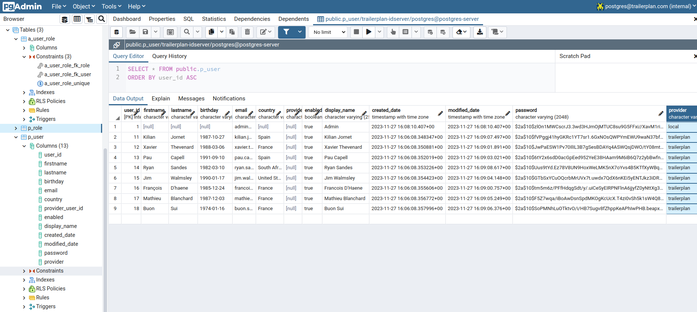
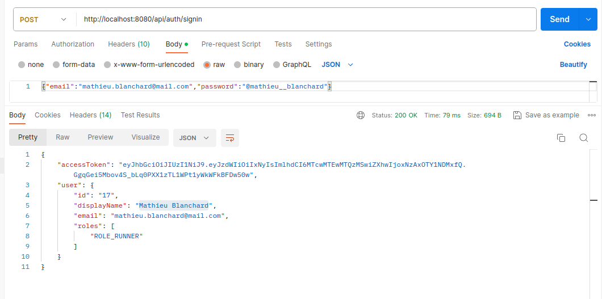

[](https://openjdk.org/projects/jdk/11/)
[](https://docs.spring.io/spring-boot/docs/2.7.17.RELEASE/reference/html/)
[](https://www.docker.com)
[](https://github.com/spotify/dockerfile-maven)
[](https://docs.docker.com/compose/)
[](https://logback.qos.ch/)
[](https://linuxmint.com/)
[](https://www.postgresql.org/)

# Identity server 

This project is an example of identity server for the project trailerplan. The users data are stored in the database postgres in a docker image. They can me browse on (http://localhost:8888/login) with 
login:postgres@trailerplan.com password:P@55w*rD

There is some environment file for local, integration (int) and staging (rct).

```shell
user@host:~.../trailerplan-idserver$ docker-compose --env-file ./data/container/config/env.local up -d postgres
[+] Running 5/5
 ⠿ Network trailerplan-idserver_postgres-network  Created                                                                                                                                0.0s
 ⠿ Volume "trailerplan-idserver_postgres-data"    Created                                                                                                                                0.0s
 ⠿ Volume "trailerplan-idserver_pgadmin-data"     Created                                                                                                                                0.0s
 ⠿ Volume "trailerplan-idserver_app_java-data"    Created                                                                                                                                0.0s
 ⠿ Container postgres-container                   Started  
```

The logs for the container postgres :
```shell
user@host:~.../trailerplan-idserver$ docker logs postgres-container
The files belonging to this database system will be owned by user "postgres".
This user must also own the server process.

The database cluster will be initialized with locale "fr_FR:UTF8".
The default database encoding has accordingly been set to "UTF8".
The default text search configuration will be set to "french".

Data page checksums are disabled.

fixing permissions on existing directory /var/lib/postgresql/data ... ok
creating subdirectories ... ok
selecting dynamic shared memory implementation ... posix
selecting default max_connections ... 100
selecting default shared_buffers ... 128MB
selecting default time zone ... UTC
creating configuration files ... ok
running bootstrap script ... ok
sh: locale: not found
2023-11-27 09:26:09.693 UTC [30] WARNING:  no usable system locales were found
performing post-bootstrap initialization ... ok
syncing data to disk ... ok
initdb: warning: enabling "trust" authentication for local connections

You can change this by editing pg_hba.conf or using the option -A, or
--auth-local and --auth-host, the next time you run initdb.

Success. You can now start the database server using:

    pg_ctl -D /var/lib/postgresql/data -l logfile start

waiting for server to start....2023-11-27 09:26:10.369 UTC [35] LOG:  starting PostgreSQL 12.5 on x86_64-pc-linux-musl, compiled by gcc (Alpine 10.2.1_pre1) 10.2.1 20201203, 64-bit
2023-11-27 09:26:10.371 UTC [35] LOG:  listening on Unix socket "/var/run/postgresql/.s.PGSQL.5432"
2023-11-27 09:26:10.399 UTC [36] LOG:  database system was shut down at 2023-11-27 09:26:09 UTC
2023-11-27 09:26:10.402 UTC [35] LOG:  database system is ready to accept connections
 done
server started
CREATE DATABASE


/usr/local/bin/docker-entrypoint.sh: running /docker-entrypoint-initdb.d/db-postgres-1-schema.sql
DROP SEQUENCE
psql:/docker-entrypoint-initdb.d/db-postgres-1-schema.sql:1: NOTICE:  sequence "p_user_id_seq" does not exist, skipping
CREATE SEQUENCE
psql:/docker-entrypoint-initdb.d/db-postgres-1-schema.sql:4: NOTICE:  table "p_user" does not exist, skipping
DROP TABLE
CREATE TABLE
ALTER TABLE
psql:/docker-entrypoint-initdb.d/db-postgres-1-schema.sql:23: NOTICE:  sequence "p_role_id_seq" does not exist, skipping
DROP SEQUENCE
CREATE SEQUENCE
DROP TABLE
psql:/docker-entrypoint-initdb.d/db-postgres-1-schema.sql:26: NOTICE:  table "p_role" does not exist, skipping
CREATE TABLE
ALTER TABLE
DROP TABLE
psql:/docker-entrypoint-initdb.d/db-postgres-1-schema.sql:34: NOTICE:  table "a_user_role" does not exist, skipping
CREATE TABLE
ALTER TABLE
ALTER TABLE
ALTER TABLE


/usr/local/bin/docker-entrypoint.sh: running /docker-entrypoint-initdb.d/db-postgres-2-data.sql
INSERT 0 1
INSERT 0 1
INSERT 0 1
INSERT 0 1
INSERT 0 1
INSERT 0 1
INSERT 0 1
INSERT 0 1
INSERT 0 1
INSERT 0 1
INSERT 0 1
INSERT 0 1
INSERT 0 1
INSERT 0 1
INSERT 0 1
INSERT 0 1
INSERT 0 1
INSERT 0 1
INSERT 0 1
INSERT 0 1
INSERT 0 1
INSERT 0 1
INSERT 0 1


waiting for server to shut down...2023-11-27 09:26:10.739 UTC [35] LOG:  received fast shutdown request
.2023-11-27 09:26:10.741 UTC [35] LOG:  aborting any active transactions
2023-11-27 09:26:10.742 UTC [35] LOG:  background worker "logical replication launcher" (PID 42) exited with exit code 1
2023-11-27 09:26:10.742 UTC [37] LOG:  shutting down
2023-11-27 09:26:10.787 UTC [35] LOG:  database system is shut down
 done
server stopped

PostgreSQL init process complete; ready for start up.

2023-11-27 09:26:10.858 UTC [1] LOG:  starting PostgreSQL 12.5 on x86_64-pc-linux-musl, compiled by gcc (Alpine 10.2.1_pre1) 10.2.1 20201203, 64-bit
2023-11-27 09:26:10.859 UTC [1] LOG:  listening on IPv4 address "0.0.0.0", port 5432
2023-11-27 09:26:10.859 UTC [1] LOG:  listening on IPv6 address "::", port 5432
2023-11-27 09:26:10.863 UTC [1] LOG:  listening on Unix socket "/var/run/postgresql/.s.PGSQL.5432"
2023-11-27 09:26:10.891 UTC [53] LOG:  database system was shut down at 2023-11-27 09:26:10 UTC
2023-11-27 09:26:10.896 UTC [1] LOG:  database system is ready to accept connections
```

To start the pgadmin docker image locally :
```shell
user@host:~.../trailerplan-idserver$ docker-compose --env-file ./data/container/config/env.local up -d pgadmin
[+] Running 2/2
 ⠿ Container postgres-container  Running                                                                                                                                                 0.0s
 ⠿ Container pgadmin-container   Started 
```

The logs for the pgadmin container :
```shell
user@host:~.../trailerplan-idserver$ docker logs pgadmin-container
NOTE: Configuring authentication for SERVER mode.

[2023-11-27 09:32:23 +0000] [1] [INFO] Starting gunicorn 19.9.0
[2023-11-27 09:32:23 +0000] [1] [INFO] Listening at: http://[::]:80 (1)
[2023-11-27 09:32:23 +0000] [1] [INFO] Using worker: threads
/usr/local/lib/python3.9/os.py:1023: RuntimeWarning: line buffering (buffering=1) isn't supported in binary mode, the default buffer size will be used
  return io.open(fd, *args, **kwargs)
[2023-11-27 09:32:24 +0000] [87] [INFO] Booting worker with pid: 87
```

To see the docker process :
```shell
user@host:~.../trailerplan-idserver$ docker ps
CONTAINER ID   IMAGE                  COMMAND                  CREATED          STATUS          PORTS                                            NAMES
8326843af0af   dpage/pgadmin4:4.30    "/entrypoint.sh"         4 minutes ago    Up 4 minutes    443/tcp, 0.0.0.0:8888->80/tcp, :::8888->80/tcp   pgadmin-container
8a905f1c1321   postgres:12.5-alpine   "docker-entrypoint.s…"   11 minutes ago   Up 11 minutes   0.0.0.0:5432->5432/tcp, :::5432->5432/tcp        postgres-container
```

In pgadmin we can see for the table users and the encoded password



Request signing with postman with the runner 'Mathieu Blanchard':

